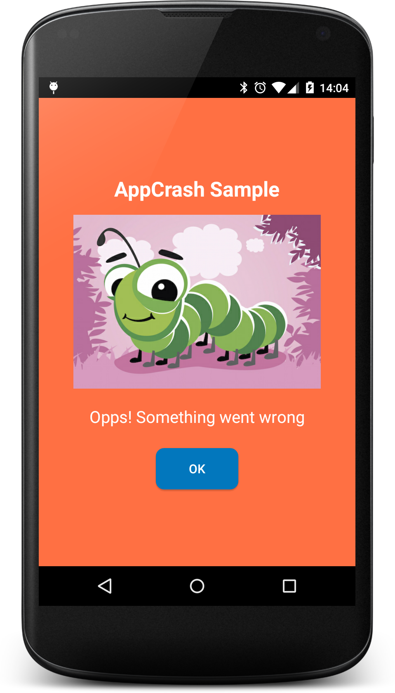
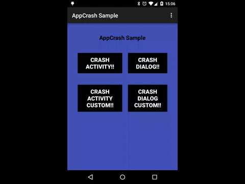
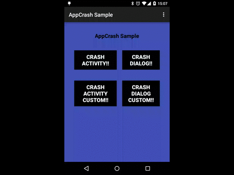
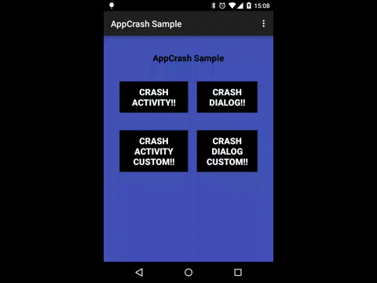

AppCrash
=============

AppCrash let you relaunch the app and manage crash message when your app has an exception.

AppCrash launch an Error default activity or an Error Dialog in your launcher Activity declared in the manifest.



Usage
-----

Add library to your build.gradle:

```java

	    compile 'com.jcmore2.appcrash:appcrash:1.0.0'

```

Init AppCrash in your Application class at the beginning of onCreate method:

```java

	public class AppApplication extends Application {

        @Override
        public void onCreate() {
            super.onCreate();

            AppCrash.init(this);
        }
    }

```

  

By default library launch an activity with an error message and when click "Ok" relaunch the activity with LAUNCHER intent in the manifest.

Instead of this behaviour, you can customize the activity and the dialog message:

To show a Dialog instead of a default Error Activity use:

```java

		AppCrash.get().showDialog();

```


Or customizing default Error Activity ``content`` , ``background`` and ``initActivity`` when crash:

```java

		AppCrash.get().withInitActivity(InitActivity.class)
                .withBackgroundColor(android.R.color.black)
                .withView(R.layout.custom_error_view);
```



Or customizing default Error Dialog ``content`` , ``background`` and ``initActivity`` when crash:

```java

        AppCrash.get().withInitActivity(InitActivity.class)
                .withBackgroundColor(android.R.color.black)
                .withView(R.layout.custom_error_view).showDialog();
```


You can check the sample App!

Credits & Contact
-----------------

AppCrash was created by jcmore2@gmail.com


License
-------

AppCrash is available under the Apache License, Version 2.0.
